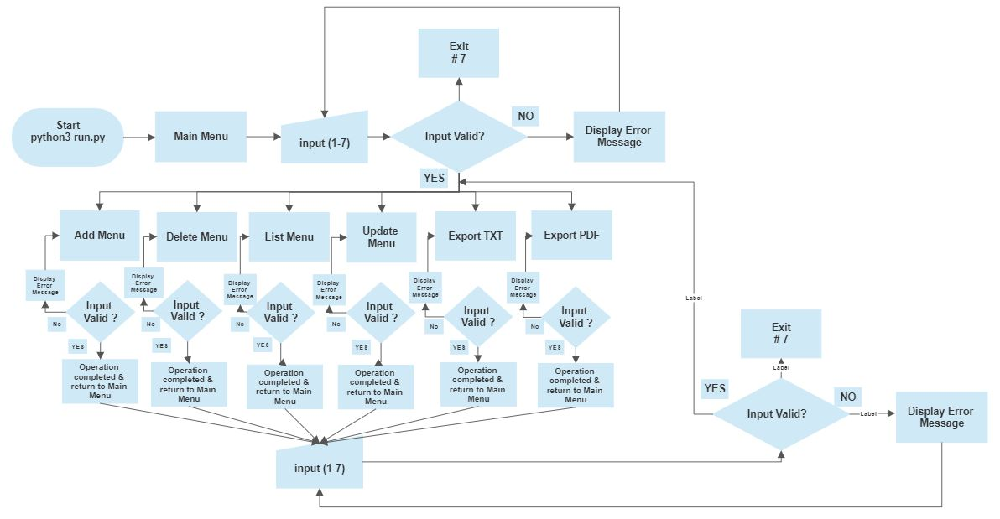

# Wind Turbines 2nd✋ - Inventory tool  
The following project consists of a **quick tool for tracking wind turbines in inventory** for small business enterprises. This case recreated a fictiony company orientated to repowering wind turnines.  
[Link to live site](https://windturbines-project3.herokuapp.com/)

## Index - Table of Contents

- [Objective](#objective)
- [Planning](#planning)
- [UX](#ux)
- [Design](#design)
  - [Implementation](#implementation)
  - [Flowchart](#flowchart)
- [Data Model](#data-model)
  - [Testing](#testing)
    - [Validator Testing](#validator-testing)
    - [Browser Testing](#browser-testing)
    - [Testing User Stories](#testing-user-stories-functionality)

- [Debugging](#debugging)

- [Deployment](#deployment)

- [Improvements](#improvements)
    - [Existing Features](#existing-features)
    - [Future Features](#possible-future-features)

- [Credits](#credits)

### Objective
* Develop a friendly checking inventory tool to track wind turbine(s) units in the warehouse. 

### Feature Planning - Snapshot.

- ### Smooth user navigation process when the tool is used.
- ### Display current date.
- ### Smooth Add, Remove, Visuallitation, and Update of data for the user. 
- ### Export options of txt & pdf files with a basic breakdown of the data entered by the user(s).
- ### Straight forward option to exit.

### UX

- ### As an employee of an inventory department, I would like the following:
  - ### Friendly tool to add wind turbines to the company's inventory.
  - ### Friendly tool to remove wind turbines from the company's inventory.
  - ### Friendly tool to see a quick breakdown of the company's inventory. 
  - ### Friendly tool to update/modify details of the wind turbines in inventory. 
  - ### Friendly tool to print out wind turbines from the company's inventory.
  - ### Friendly option to exit the software.

### Design
The present software version is a raw tool, i.e., no images. However, it has been included some **symbol emoji** and colours also. The colors used are as follow: **Green, Blue, Cyan, Yellow, and Red**.

The current version offers to the user(s) the following options: ADD items, LIST items, REMOVE items, UPDATE items, PRINT REPORT IN TXT & PDF files.

  ### Implementation
  This tool support structure is as follows:
  - #### Main Menu: ADD, DELETE, LIST,  UDPATE, EXPORT FILES  [PDF & TXT], & EXIT options. See image 1 below.

image 1

  - #### ADD option: Agent Name, Manufacturer, Model, Country, Year, Nominal Power [kW]. See image 2 below.

image 2

  - #### DELETE option: Select the item to remove and message confirmation. See images 3 & 4 below.

image 3

image 4

  - #### LIST option: Display Item(s) in Inventory. See image 5 below.

image 5. This image prior to be deleted item 2.

  - #### Update option: Same fields as ADD option to be updated. See image 6 below.

image 6

  - #### Export option 7 & 8: TXT & PDF Files produced. See image 7 below.

image 7 & 8

  - #### EXIT option - 7 -: Leave the tool. See image 9 below.

image 9

### Flowchart
See the map out below:
  
image 10

### Data Model

- #### OOP & class use
The coding includes class level(s) to create different instances depending on user choice and navigation.

- #### Error Handling / Validation
The draft or initial version didn't include any statement or code clause to capture and inform if the user's input were valid or invalid, the print statement was used only. However, there have been included functions and statements to improve the current software version regarding errors detection.

If and try/except statements were implemented all over the coding to handle errors. However, this demands more time testing to detect as many user errors as possible to improve more the code and mitigate issues. See main comments below.

  #### a. The user(s) must type the correct option's number from the main menu, otherwise, an alert message will pop up unit the user select the correct option.
 ##### b. In the sub-menu level, user must input the correct info, otherwise, they will be alert to repeat the operation in red colour and returning to the main menu in all the cases.
 ##### c. if user(s) request any option without a prior data input, the software will alert to the user(s) with an alert in red colour.
  ##### d. The fields of Manufacturer & Model are free of character restrictions due to their input nature. Other input fields have been validated.

- #### Validator Testing
The coding includes class level(s) to create different instances depending on user choice and navigation. See images (11-22) of testing completed below.

  - #### Main Menu: Wrong input. Result: Issue detected.

image 11

  - #### Main Menu: Wrong input.Result: Issue detected.

image 12

  - #### Main Menu: Wrong input. Result: Issue detected.

image 13

  - #### Main Menu: Wrong input. Result: Issue detected.

image 14

  - #### Main Menu: Wrong input. Result: Issue detected.

image 15

  - #### Main Menu: Wrong input. Result: Issue detected.

image 16

  - #### Add: Wrong input. Result: Issue detected.

image 17

  - #### Add: Wrong input. Result: Issue detected.

image 18

  - #### Add: Wrong input. Result: Issue detected.

image 19

  - #### Delete: Wrong input and correct input. Result: Issue detected.

image 20

  - #### List: Wrong input and correct input. Result: Issue detected.

image 21

  - #### List: Wrong input and correct input. Result: Issue detected.

image 22

 - #### Accessibility & Performance. Score: Please, see results below:

image 23

- #### Browser Testing. 
Result: Please, see performence below:

image 24

- #### Testing User Stories (Functionality). 
Result: Requirements completed. Please, see results below:

image 25

The template provided by Code Institute as provided to all students is assumed to be tested for the above.

Using the file template [code institute], no ajor errors remain in current coding version. 

#### Debugging

There have been fixed over 100 errors, and the main bugs found are as follow:

- #### Formating: Indetation, Trailing whitespace (W291), lines breaks, No newline at end of file (W292), .

- #### Update and Delete option could not differenciate when the user enters 0, 1, and 2: This Bug displayed different error message such as ValueError: invalid literal for int() with base 10, IndexError: list out of range, Traceback (most recent call last). See solution in image 23 below.

- #### Bug solution:

image 26

- #### Deployment was not proforming correctly: It was not added the colorama framework to requirement.txt file causing issues. Thanks to Slack feedback I could solved this issue. 

#### Deployment
The platform used for the project's implementation is Heroku. The steps to deploy the code are as follow:

- ##### Fork/Clone this public repository.
- ##### Open a Heroku account.
- ##### Create a new App with Heroku.
- ##### Add 2 building packs in settings.
- ###### Python
- ###### NodeJS
- ##### Ensure the buildpacks are created in that sequence.
- ##### Allowing Heroku access to GitHub, and link the new app to the relevant repository.
- ##### Select if or not to enable Automatic Deploys. If enabled, the deployed app will update automatically with each push to GitHub.
- ##### Click Deploy

#### Improvements
- ##### Enhance the code structure, cleaning it up reviewing and defining a function for each task expected. This will help to add more complicated code lines to maintain a clean and really useful way structural-wise.  
- ##### Add more validation against user's errors such as limiting the length of digits, defining a clear format for the year field [range time], filtering out the mixing of characters & letters per field, adding regular expressions control for the current and future fields, and adding email fields and its validation also. Eventually, report options can be tied with the submission of & text files via email, and improve the interface with the user(s) to make it more friendly, among others.

#### Credits

- ###### Emoticon: https://www.alt-codes.net/smiley_alt_codes.php
- ###### Template and Terminal: https://github.com/Code-Institute-Org/python-essentials-template
- ###### Software background: The current software version is based on the file named software background.zip
- ###### Styling: Colorama was imported to this software version.
- ###### Date: Datetime was imported to this software version.
- ###### Text & PDF files: Textwrap FPDF were imported to this software version.